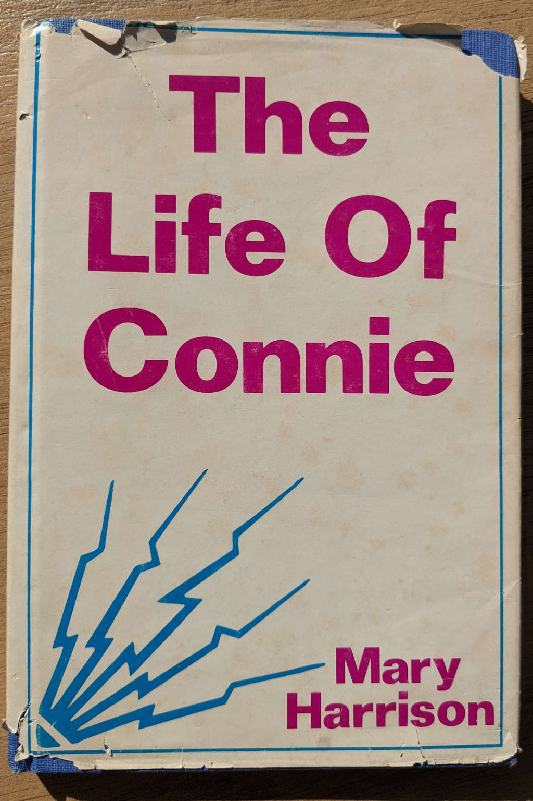
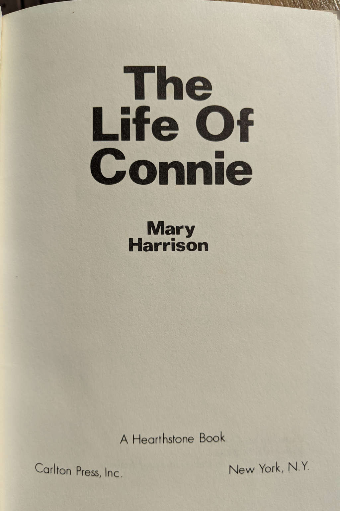
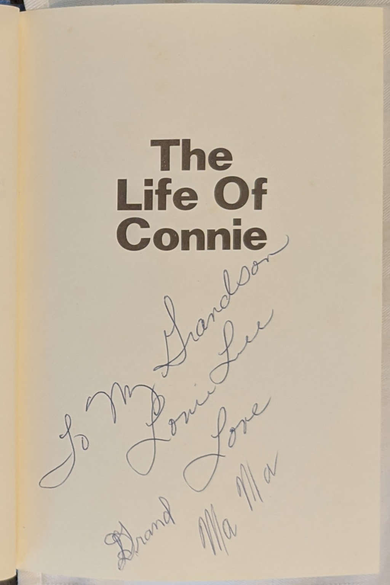
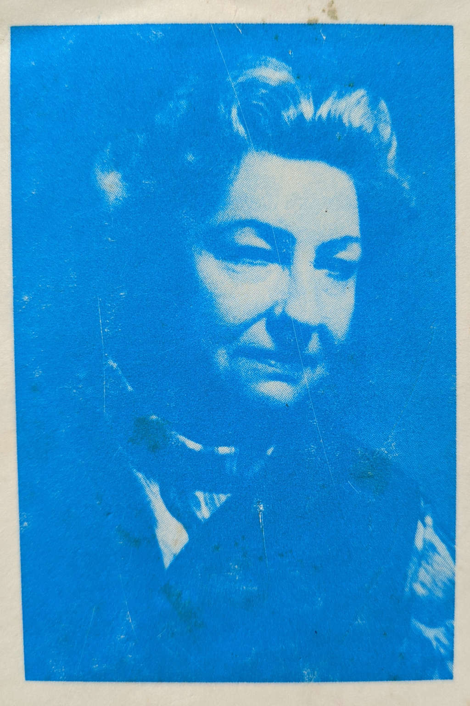
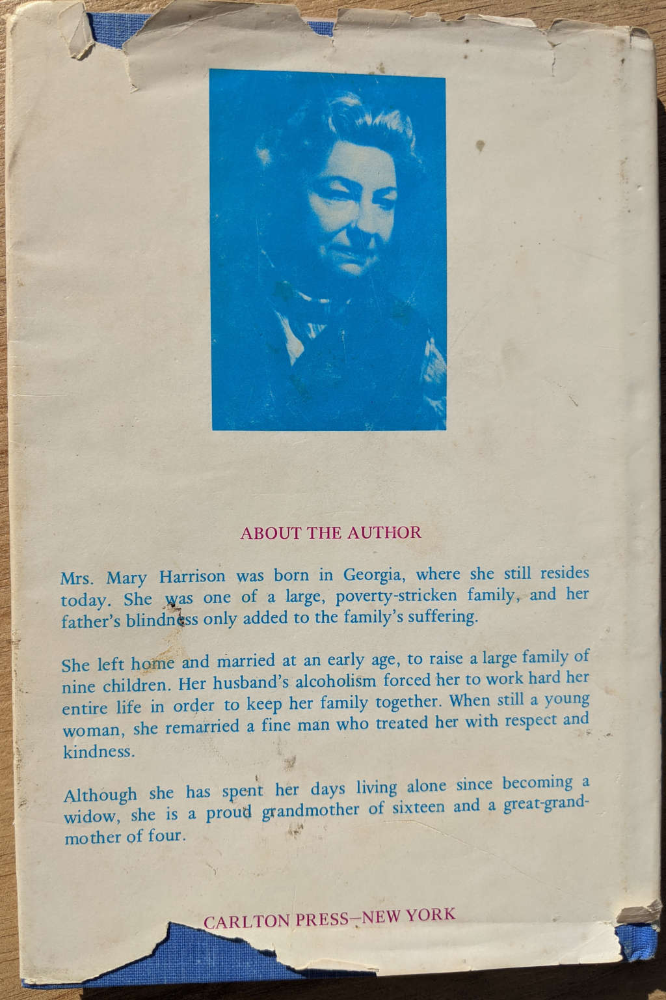

# About the E-book

*The Life Of Connie* was transposed to e-book formats
using markdown and [pandoc](https://pandoc.org/).

The following photos were taken of the book used for transposition
by Lee Braddy on October 3 and 4, 2020.

{ width=2.75in }

{ width=2.75in }

{ width=2.75in }

{ width=2.75in }

{ width=2.75in }
